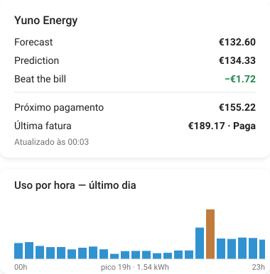

# Yuno Energy

Home Assistant add-on that logs into [Yuno Energy](https://yunoenergy.ie) (Irish electricity supplier) and exposes your bill forecast, electricity usage, vampire energy, and latest bill as sensors.

<p align="center">
  
</p>

## ⚠️ Important notice

This is an unofficial project, built through reverse engineering — with no relationship, affiliation, or endorsement from Yuno Energy or PrepayPower.

Since I'm no longer a Yuno customer myself (my lovely wife switched our electricity account the day after I finished this project 😅), I have no way to keep testing this add-on if Yuno changes something on their end. Feel free to use and modify it however you like. Use at your own risk.

## How this was built

Yuno Energy has no public API. To make this add-on work, I had to fully reverse-engineer the official Android app: decompiling the APK, and — since part of the login flow encrypts your email/password in a way that could only be confirmed by watching the real app talk to the real backend — intercepting my own network traffic (on my own account, without accessing anything belonging to anyone else or any company system).

The result is `yuno_client.py`, a plain Python client that reproduces the app's login and query flow using `requests` — no browser, no app, just your own email and password.

## About the app credential

Besides your personal login, Yuno's API requires a second credential — fixed, embedded in the app itself, the same for every install. I'm not distributing that credential directly in this repository. Instead, I've documented how anyone can extract their own copy from the app's public APK — it's a plain text string, no advanced reverse engineering needed to find it. See [`EXTRACTING_CREDENTIAL.md`](EXTRACTING_CREDENTIAL.md) for the step-by-step.

## Features

- Pure Python, no browser engine required
- Publishes 5 sensors over [MQTT discovery](https://www.home-assistant.io/integrations/mqtt/#mqtt-discovery) with retained messages, so entities and their last known values survive a Home Assistant restart
- Configurable polling interval (defaults to once a day, matching how often Yuno's own smart meter data actually refreshes — see [Known limitations](#known-limitations))

## Installation

1. Make sure you have a working MQTT broker reachable from Home Assistant (either the official Mosquitto add-on, or an external broker), with the [MQTT integration](https://www.home-assistant.io/integrations/mqtt/) configured in Home Assistant.
2. In Home Assistant, go to **Settings → Add-ons → Add-on Store**.
3. Click the **⋮** menu (top right) → **Repositories**, and add:
   ```
   https://github.com/maroliar/ha-addon-yuno-energy
   ```
4. Find **Yuno Energy** in the store and click **Install**.
5. Go to the **Configuration** tab and fill in:
   - `yuno_email` / `yuno_password` — your Yuno Energy app login
   - `update_interval_minutes` — how often to check (default: `1440`, once a day)
   - `mqtt.host`, `mqtt.port`, `mqtt.user`, `mqtt.pass` — your broker's connection details
6. Start the add-on. Check the **Log** tab to confirm it logged in and published to MQTT successfully.

## The sensors

| Sensor | State | Key attributes |
|---|---|---|
| `sensor.yuno_forecast` | Current billing period forecast (€) | `prediction_euro`, `next_period_forecast_euro`, `beat_the_bill_euro`, billing period start/end dates |
| `sensor.yuno_next_payment` | Next payment amount (€) | `next_payment_date` |
| `sensor.yuno_usage_latest_day` | Most recent day's usage (kWh) | `usage_euro`, `standing_charge_euro`, `hourly_kwh` (24 values) |
| `sensor.yuno_vampire_energy` | Annual vampire (standby) energy cost (€) | `daily_kwh`, `monthly_comparison_euro` |
| `sensor.yuno_last_bill` | Most recent bill total (€) | `status`, `date_of_bill_creation`, `reference`, `invoice_id` |

## Dashboard card (optional)

Any of these sensors work with any card that reads entity state/attributes — there's no required way to display them. Below is one suggestion: a Markdown card for the bill/payment picture (mirrors the app's own Prediction/Forecast home screen) stacked with an hourly usage graph, using only native cards (no HACS):

<p align="center">
  
</p>

```yaml
type: markdown
entity_id: sensor.yuno_forecast
content: |
  **Forecast:** €{{ states('sensor.yuno_forecast') }}
  **Prediction:** €{{ state_attr('sensor.yuno_forecast', 'prediction_euro') }}
  **Beat the bill:** €{{ state_attr('sensor.yuno_forecast', 'beat_the_bill_euro') }}

  ---
  **Next payment:** €{{ states('sensor.yuno_next_payment') }} on {{ state_attr('sensor.yuno_next_payment', 'next_payment_date') }}
  **Last bill:** €{{ states('sensor.yuno_last_bill') }} · {{ state_attr('sensor.yuno_last_bill', 'status') }}
```

```yaml
type: history-graph
title: Hourly usage — latest day
entities:
  - sensor.yuno_usage_latest_day
hours_to_show: 24
refresh_interval: 0
```

`content: |` (not `>`) matters — Markdown's syntax is whitespace-sensitive, so the block style has to preserve line breaks literally. The `entity_id:` line isn't decoration either: without it, Home Assistant sometimes can't detect which entity the template depends on, and the card won't refresh reliably.

## Known limitations

- **Data is not real-time.** Yuno's own FAQ states smart meter usage data is only pulled from ESB Networks once a day — checking more often than `update_interval_minutes: 1440` won't get you fresher data, it'll just repeat the same numbers (and add unnecessary load on Yuno's systems).
- Gas accounts (dual-fuel) aren't surfaced as sensors yet — `yuno_client.py` has `get_gas_billing_details()` but `main.py` doesn't publish it.

## Roadmap

- [ ] Gas sensors for dual-fuel accounts
- [ ] Payment history / payment card sensors
- [ ] Configurable log level

## License

[MIT](LICENSE)
